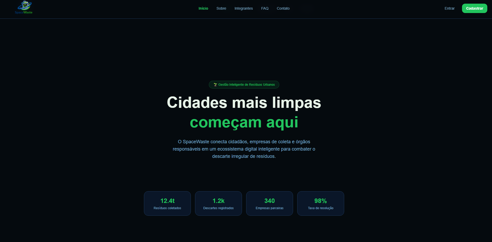
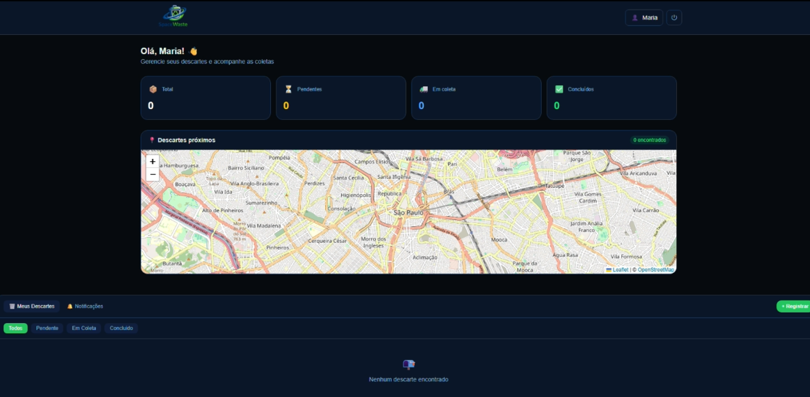
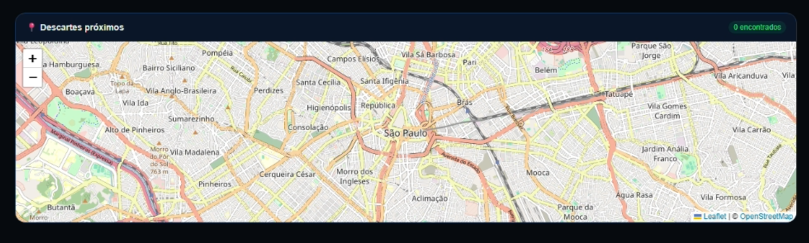

# 🌍 SpaceWaste — Gestão Inteligente de Resíduos Urbanos

> Plataforma digital que conecta cidadãos, empresas de coleta e órgãos públicos para combater o descarte irregular de resíduos urbanos, utilizando geolocalização, e análise de dados em tempo real.

---

## Tecnologias Utilizadas

### Front-end
| Tecnologia | Versão | Descrição |
|------------|--------|-----------|
|  React | 19.x | Biblioteca para interfaces componentizadas |
|  TypeScript | 5.x | Tipagem estática para maior confiabilidade |
|  Vite | 6.x | Build tool ultra-rápido |
|  Tailwind CSS | 4.x | Estilização utilitária e responsiva |
| React Router DOM | 7.x | Roteamento SPA com rotas estáticas e dinâmicas |
| Framer Motion | 12.x | Animações fluidas |
| Leaflet + React Leaflet | 1.9.x | Mapas interativos com geolocalização |

### Back-end
| Tecnologia | Descrição |
|------------|-----------|
| Java 21 + Quarkus 3.x | API REST robusta e de alta performance |
| Oracle Database | Banco de dados relacional |
---

## Estrutura de Pastas

```
space-waste-frontend/
├── public/
│   ├── logo.png
│   ├── manuella.jpg
│   ├── gustavo.jpg
│   └── mariana.jpg
├── src/
│   ├── assets/
│   ├── components/
│   │   ├── layout/
│   │   │   ├── ConteudoPrincipal.tsx
│   │   │   ├── Navbar.tsx
│   │   │   └── Rodape.tsx
│   │   └── modais/
│   │       ├── ModalLogin.tsx
│   │       ├── ModalCadastro.tsx
│   │       ├── ModalConfirmacao.tsx
│   │       ├── ModalErro.tsx
│   │       ├── ModalRegistroDescarte.tsx
│   │       ├── ModalResultadoIA.tsx
│   │       ├── ModalDetalhesDescarte.tsx
│   │       └── ModalPerfil.tsx
│   ├── context/
│   │   └── AuthContext.tsx
│   ├── pages/
│   │   ├── PaginaInicial.tsx
│   │   ├── Sobre.tsx
│   │   ├── Integrantes.tsx
│   │   ├── IntegranteDinamico.tsx
│   │   ├── FAQ.tsx
│   │   ├── Contato.tsx
│   │   ├── DashboardUsuario.tsx
│   │   ├── DashboardEmpresa.tsx
│   │   └── PaginaRelatorio.tsx
│   ├── services/
│   │   └── api.ts
│   ├── App.tsx
│   ├── main.tsx
│   └── index.css
├── index.html
├── package.json
├── tsconfig.json
├── vite.config.ts
└── README.md
```

---

## Imagens do Sistema

### Landing Page


### Dashboard do Usuário


### Mapa Interativo


---

## 👥 Autores e Créditos

<table>
  <tr>
    <td align="center">
      <br/>
      <b>Manuella Rinaldi</b><br/>
      RM567915 · 1TDSPH<br/>
      <a href="https://github.com/">GitHub</a> ·
      <a href="https://linkedin.com/in/">LinkedIn</a>
    </td>
    <td align="center">
      <br/>
      <b>Gustavo Miguel Martins de Oliveira</b><br/>
      RM566666 · 1TDSPH<br/>
      <a href="https://github.com/">GitHub</a> ·
      <a href="https://linkedin.com/in/">LinkedIn</a>
    </td>
    <td align="center">
      <br/>
      <b>Mariana de Paula Aguiar</b><br/>
      RM566850 · 1TDSPH<br/>
      <a href="https://github.com/">GitHub</a> ·
      <a href="https://linkedin.com/in/">LinkedIn</a>
    </td>
  </tr>
</table>

---

##  Como Usar

### Pré-requisitos
- Node.js 18+
- npm 

### Instalação e execução local

```bash
# 1. Clone o repositório
git clone https://github.com/SEU_USUARIO/space-waste-global-solution.git

# 2. Entre na pasta do projeto
cd space-waste-global-solution

# 3. Instale as dependências
npm install

# 4. Inicie o servidor de desenvolvimento
npm run dev

# 5. Acesse no navegador
# http://localhost:5173
```

### Links importantes

| Recurso | Link |
|---------|------|
|  Repositório GitHub | [https://github.com/GustavoMiguelk/space-waste-global-solution](https://github.com/GustavoMiguelk/space-waste-global-solution) |
|  Vídeo no YouTube | [https://youtu.be/LVZ9B-l0eBs](https://youtu.be/LVZ9B-l0eBs) |
|  Deploy na Vercel | [https://space-waste-global-solution.vercel.app?_vercel_share=xcPF0s4zsz5Bpu7r8bNOKwXplREWeSw2](https://space-waste-global-solution.vercel.app?_vercel_share=xcPF0s4zsz5Bpu7r8bNOKwXplREWeSw2) |

---

##  Rotas da Aplicação

| Rota | Tipo | Descrição |
|------|------|-----------|
| `/` | Estática | Landing page |
| `/sobre` | Estática | Sobre o projeto |
| `/integrantes` | Estática | Lista de integrantes |
| `/integrantes/:id` | **Dinâmica** | Perfil individual do integrante |
| `/faq` | Estática | Perguntas frequentes |
| `/contato` | Estática | Contato |
| `/dashboard` | Protegida | Dashboard do cidadão |
| `/empresa` | Protegida | Dashboard da empresa |
| `/relatorios` | Protegida | Relatórios e métricas |

---


